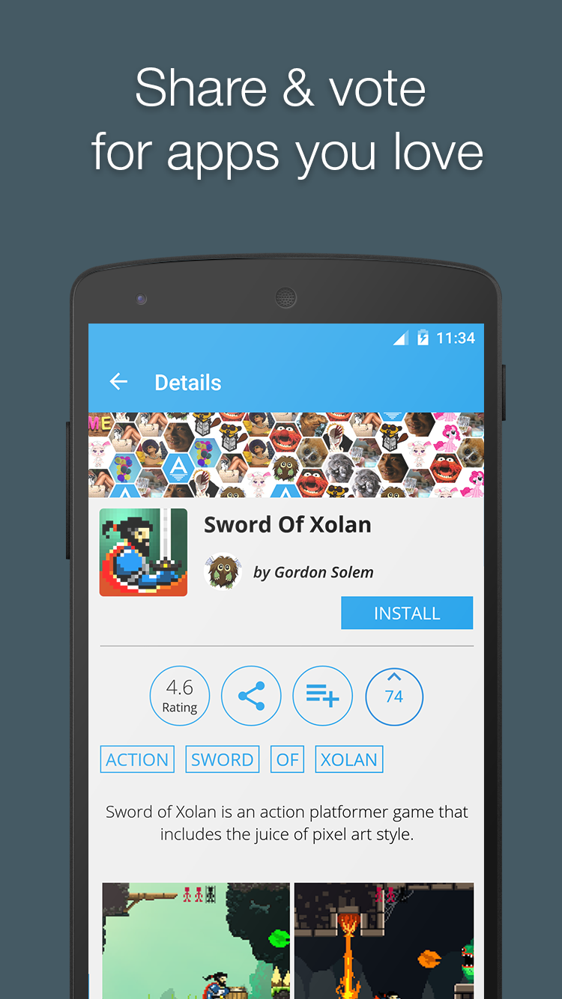

# JHexed - Android Library for Hexagonal Networks

## What is jHexed?

jHexed is a library you can use to create a network of hexagonal looking images. The original library can be found [HERE](https://github.com/raydac/jhexed).

## What is different in this version?

It has a bug fix for the Android devices which was causing the network not to calculate correctly. If you place it in a ScrollView there is still a chance for the network not to be calculated correctly. 
We also offer the **JHexedPhotoView** which is a custom view/class you can use in your code. It can be found in the src library -> com.igormaznitsa.jhexed.engine.

## How to use it?
Move the **JHexedPhotoView** to your Android project. 

Add to attrs.xml
```
<declare-styleable name="JHexedPhotoView">
     <attr name="cellWidth" format="integer"/>
     <attr name="cellHeight" format="integer"/>
     <attr name="fieldWidth" format="integer"/>
     <attr name="fieldHeight" format="integer"/>
     <attr name="hexBorder" format="color"/>
     <attr name="hexSelectedBorder" format="color"/>
     <attr name="hexLineWidth" format="float"/>
 </declare-styleable>
```

Set a container in an XML. 

```
 <LinearLayout
            android:id="@+id/hexedView"
            android:layout_width="match_parent"
            android:layout_height="150dp"
            android:orientation="vertical"
            android:gravity="center">
            
 </LinearLayout>
```
 Find the container
 ```
    @InjectView(R.id.hexedView)
    LinearLayout container;
 ```
Create an AsyncTask to load the images in background and then populate the view.

```
 new AsyncTask<Void, Void, Void>() {
    final List<Bitmap> icons = new ArrayList<Bitmap>();
    @Override
    protected Void doInBackground(Void... params) {
        Random random = new Random();
        int size = users.size();
        for (int i = 0; i < size; i++) {
            try {
              
                User user = users.get(i);
                Bitmap image = Picasso.with(getActivity()).load(user.getProfilePicture())
                        .tag(TAG_LOAD_VOTERS_REQ).get();
                if(image != null) {
                    icons.add(image);
                }
            } catch (Exception e) {
                Crashlytics.logException(e);
                e.printStackTrace();
            }
        }

        return null;
    }

    @Override
    protected void onPostExecute(Void aVoid) {
        if(isAdded()) {
            icons.add(BitmapFactory.decodeResource(getResources(), R.drawable.ic_logo_a, null));
            hexedView = new JHexedPhotoView(getActivity(), icons);
            hexedView.setBackgroundColor(getResources().getColor(R.color.bg_primary));
            container.addView(hexedView,
                    new LinearLayout.LayoutParams(LinearLayout.LayoutParams.MATCH_PARENT,
                            getResources().getDimensionPixelSize(R.dimen.app_details_hexagon)));
        }
    }
}.execute();
```

## The Result



